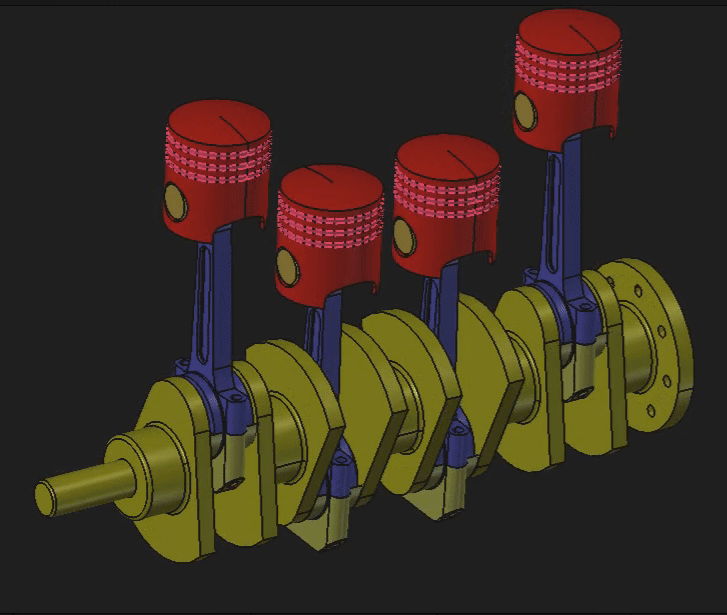

# 4 Cylinder Engine Crankshaft and Piston Assembly

A 3D CAD model of a multi-cylinder internal combustion engine rotating assembly, designed and modeled using FreeCAD.

## Overview
This project features a complete bottom-end mechanical assembly consisting of 4 pistons, connecting rods, and crankshaft. It demonstrates proficiency in part modeling, assembly constraints, and mechanical systems design tailored for mechanical engineering.

## Demonstration


## Info on Materials & Components
The repository contains the following FreeCAD (`.FCStd`) component and assembly files:
* `Assembly.FCStd` - Top-level master assembly integrating all components.
* `Part1-Piston.FCStd` - Piston body.
* `Part2-PistonRing.FCStd` - Piston rings.
* `Part3-Crankshaft.FCStd` - Multi throw crankshaft.
* `Part4-ConnectingRod.FCStd` - Connecting rod main body.
* `Part5-ConnectingRodCap.FCStd` - Connecting rod bearing cap.
* `Part6-PistonPin.FCStd` - Pin to connect Piston with Connecting Rod.

## Engineering Highlights
* **Parametric Modeling:** Individual components are modeled with fully constrained sketches and features.
* **Assembly Constraints:** Utilizes FreeCAD assembly workflows to establish proper alignment and fit between the pistons, pins, connecting rods, and crankshaft throws.
* **Mechanical Functionality:** Visualizes the translation of linear piston motion into rotational torque via the crankshaft.

## Software Requirements
* [FreeCAD](https://www.freecad.org/) (Recommended version: 1.0 or newer)

## Usage

- ### Option 1 (local setup)
1. Clone the repository:
   ```bash
   git clone [https://github.com/AnupAdhikari64/crankshaft-piston.git](https://github.com/AnupAdhikari64/crankshaft-piston.git)
2. Open it locally on FreeCAD

- ### Option 2 (View the model online)
*any online viewer can be used, I personally have tested this on [thecadhub.com](https://thecadhub.com/free-tools/freecad-web/)*
1. Head over to [The CAD Hub FreeCAD Web Viewer](https://thecadhub.com/free-tools/freecad-web/).
2. Upload all individual `.FCStd` part files along with `Assembly.FCStd` simultaneously into the workspace so the assembly can correctly resolve its file links.
